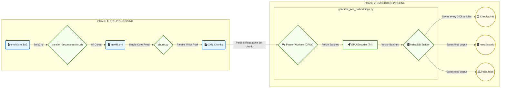

# Wikipedia Semantic Search Engine

This project contains a complete, production-grade pipeline to build a semantic search engine from a raw English Wikipedia dump. The system is broken into two main stages, followed by a powerful, database-driven testing suite.

1.  **Stage 1: Embeddings Pipeline:** Ingests the 100GB+ XML dump, extracts 6.7M+ articles, generates vector embeddings (using `all-MiniLM-L6-v2`), and builds a compressed FAISS index and a `metadata.db`.
2.  **Stage 2: Metadata Enrichment:** Ingests the 30GB+ `pagelinks.sql` dump and daily pageview data to enrich the `metadata.db` with popularity and importance signals (backlinks, pageviews) for advanced re-ranking.
3.  **API & Testing Suite:** A Flask server to query the final database and a comprehensive testing suite to track performance and quality regressions over time.

---

## 🏛️ System Architecture

This diagram shows the high-level flow of data through the three main components of the project.

