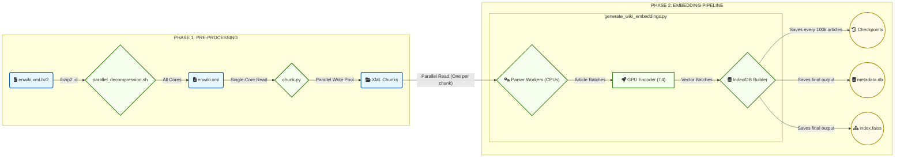

# Wikipedia Embeddings Generation System

The code for pages_articles is a distinct system processing the largest dump, I used a GCP VM with a Tesla 4 to decrease job time from days (with my laptop) to hours, in November 2025 it cost me ~$14 and took several hours.

### Stage One - pages_articles

### Overview
This system generates semantic embeddings for all 6.9M English Wikipedia articles using a production-optimized pipeline with:
- Multi-core XML parsing
- GPU-accelerated batch encoding  
- Incremental FAISS index building
- Automatic checkpointing every 100K articles
- Comprehensive validation

## System Architecture

#### Download Wiki dump

aria2c -x 16 -s 16 "https://dumps.wikimedia.org/enwiki/20251101/enwiki-20251101-pages-articles-multistream.xml.bz2"

### Key Features

- **Resume Capability**: Automatic checkpoint detection and resume from last saved state
- **Memory Efficient**: Streaming XML parsing with element cleanup prevents OOM
- **GPU Optimized**: FP16 inference with batched encoding maximizes Tesla T4 utilization
- **Production Ready**: IVF+PQ compression reduces index size by ~8x with minimal accuracy loss
- **Fault Tolerant**: Checkpoint every 100K articles + graceful interrupt handling

## Stage Two - Enhance Vector DB

prepDb.py

getPageviews.py

processPageviews.py

processPagelinks.py

