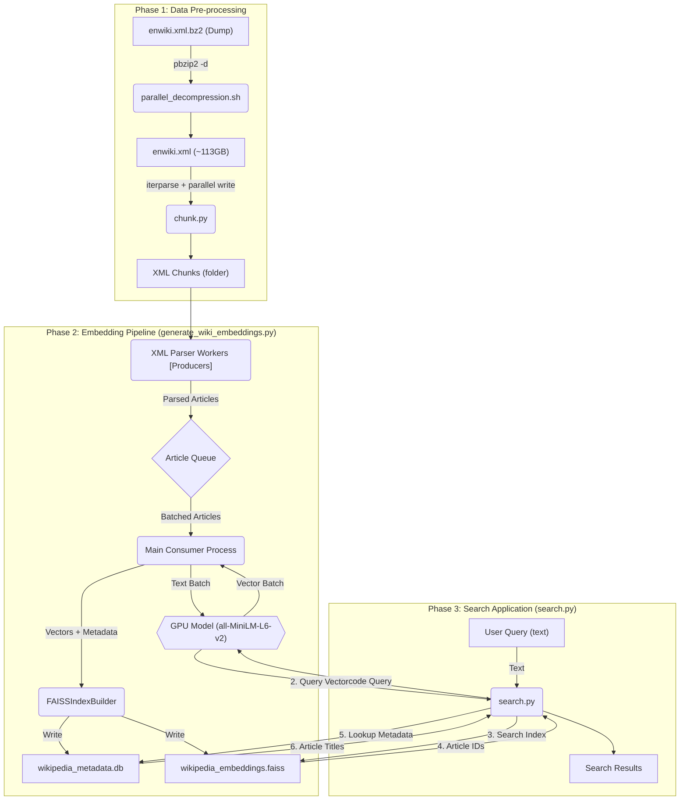

# Wikipedia Embeddings Generation System
## Production-Grade Pipeline

### Overview
This system generates semantic embeddings for all 6.9M English Wikipedia articles using a production-optimized pipeline with:
- Multi-core XML parsing
- GPU-accelerated batch encoding  
- Incremental FAISS index building
- Automatic checkpointing every 100K articles
- Comprehensive validation

## System Architecture

### Key Features

- **Resume Capability**: Automatic checkpoint detection and resume from last saved state
- **Memory Efficient**: Streaming XML parsing with element cleanup prevents OOM
- **GPU Optimized**: FP16 inference with batched encoding maximizes Tesla T4 utilization
- **Production Ready**: IVF+PQ compression reduces index size by ~8x with minimal accuracy loss
- **Fault Tolerant**: Checkpoint every 100K articles + graceful interrupt handling
